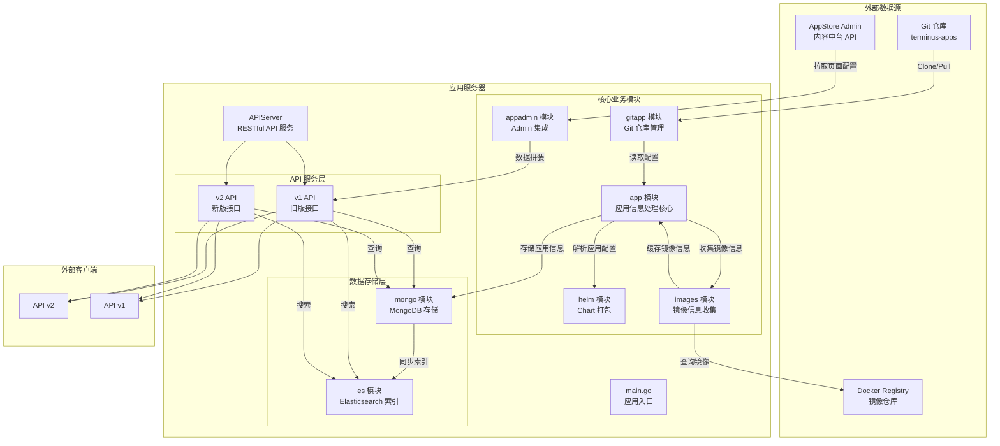
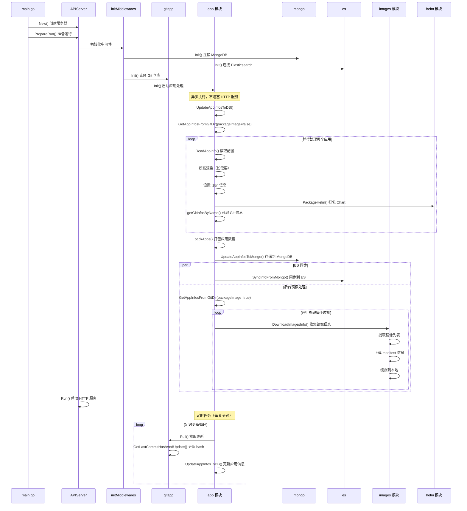
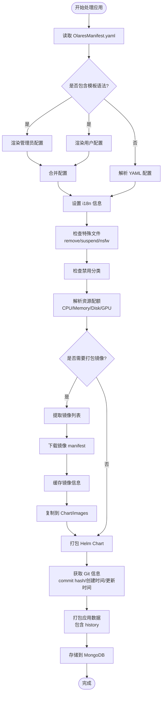
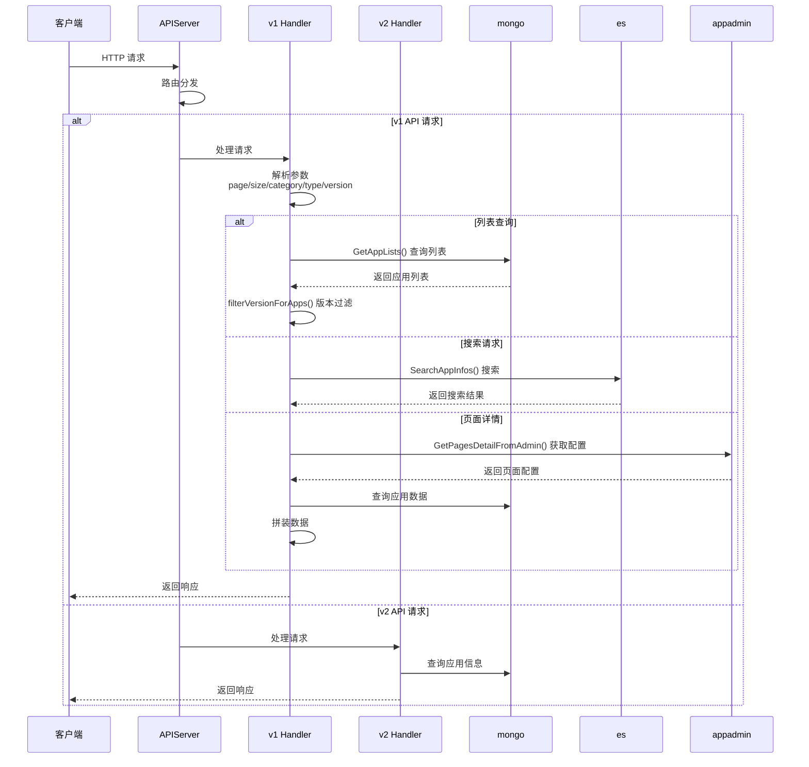
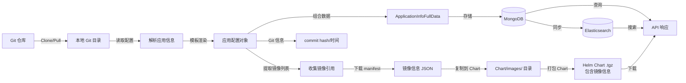

# app-store-server
market-server（app-store-server）是 App Store 的核心后端服务，从 Git 仓库和 admin 中拉取并索引应用信息，提供应用列表/搜索/详情等 REST 接口给 Market 前端和其他服务使用。

## 架构&设计

### 重点
- **与 admin 的内容中台集成(v1版本,匹配1.11.x)**：通过 `internal/appadmin.GetPagesDetailFromAdmin(version)` 等方法，从 appstore-admin 拉取页面/推荐/专题配置，并与应用数据拼装，对上屏蔽 admin 具体实现细节。
- **v1 + v2 API 共存**：通过 `servicev1`、`servicev2` 同时挂载旧/新接口，便于渐进迁移；
- **基于 lastCommitHash 的版本一致性**：Mongo/ES 查询默认带 `history.latest.lastCommitHash == 当前 hash` 条件，确保列表、搜索结果都与当前 git 提交一致，不会混入旧数据。
- **异步初始化 + 周期同步**：启动时异步执行 `UpdateAppInfosToDB`，确保 HTTP 服务尽快可用；之后通过 `pullAndUpdateLoop` 每 5 分钟执行 `GitPullAndUpdate`，持续拉取并应用增量。
- **Docker 镜像信息收集与缓存**：在打包 Chart 时扫描所有镜像引用，对每个镜像分别使用传统 Registry API（v1）与 `containers/image/v5`（v2）获取 manifest / inspect 信息，带重试机制落盘到本地持久缓存，再同步拷贝到 Chart 下的 `images/` 与 `images-v2/` 目录，用于多架构镜像展示与离线分析。

### 系统架构图



### 应用初始化与更新流程



### 应用处理详细流程



### API 请求处理流程




## 数据流



## API 文档

### 基础信息

- **Base URL**: `/app-store-server`
- **API 文档**: `/app-store-server/v1/apidocs.json` (Swagger/OpenAPI 格式)
- **响应格式**: 所有 API 返回统一的 JSON 格式：
  ```json
  {
    "code": 200,
    "message": "success",
    "data": {}
  }
  ```

### v1 API

#### 1. 获取应用列表

**GET** `/app-store-server/v1/applications`

获取应用列表，支持分页、分类、类型过滤。

**查询参数**:
- `page` (string, 可选): 页码，从 1 开始
- `size` (string, 可选): 每页数量
- `category` (string, 可选): 分类过滤
- `type` (string, 可选): 应用类型过滤
- `version` (string, 可选): 系统版本，默认为 "1.10.9-0"，支持 "latest"

**响应示例**:
```json
{
  "code": 200,
  "message": "success",
  "data": {
    "items": [...],
    "total": 100
  }
}
```

#### 2. 获取应用类型列表

**GET** `/app-store-server/v1/applications/types`

获取所有应用类型（分类）列表。

**查询参数**:
- `version` (string, 可选): 系统版本

**响应示例**:
```json
{
  "code": 200,
  "message": "success",
  "data": {
    "items": ["category1", "category2", ...],
    "total": 10
  }
}
```

#### 3. 下载应用 Chart

**GET** `/app-store-server/v1/application/{name}`

下载指定应用的 Helm Chart 包（.tgz 文件）。

**路径参数**:
- `name` (string, 必需): 应用名称

**查询参数**:
- `version` (string, 可选): 系统版本

**响应**: 返回二进制文件流（.tgz 格式）

#### 4. 获取热门应用列表

**GET** `/app-store-server/v1/applications/top`

获取热门应用列表，按安装量排序。

**查询参数**:
- `size` (string, 可选): 返回数量
- `type` (string, 可选): 应用类型过滤
- `excludedLabels` (string, 可选): 排除的标签，逗号分隔
- `version` (string, 可选): 系统版本

**响应示例**:
```json
{
  "code": 200,
  "message": "success",
  "data": {
    "items": [...]
  }
}
```

#### 5. 获取应用详情

**GET** `/app-store-server/v1/applications/info/{name}`

获取指定应用的详细信息。

**路径参数**:
- `name` (string, 必需): 应用名称

**查询参数**:
- `version` (string, 可选): 系统版本

**响应示例**:
```json
{
  "code": 200,
  "message": "success",
  "data": {
    "id": "app-id",
    "name": "app-name",
    "version": "1.0.0",
    ...
  }
}
```

#### 6. 获取应用 README

**GET** `/app-store-server/v1/applications/{name}/README.md`

获取指定应用的 README 文档内容。

**路径参数**:
- `name` (string, 必需): 应用名称

**响应**: 返回 Markdown 格式的文本内容

#### 7. 更新应用信息

**POST** `/app-store-server/v1/applications/update`

手动触发从 Git 仓库更新应用信息。

**响应示例**:
```json
{
  "code": 200,
  "message": "success",
  "data": null
}
```

#### 8. 搜索应用

**GET** `/app-store-server/v1/applications/search/{name}`

根据应用名称搜索应用（支持通配符）。

**路径参数**:
- `name` (string, 必需): 搜索关键词

**查询参数**:
- `page` (string, 可选): 页码
- `size` (string, 可选): 每页数量
- `version` (string, 可选): 系统版本

**响应示例**:
```json
{
  "code": 200,
  "message": "success",
  "data": {
    "items": [...],
    "total": 10
  }
}
```

#### 9. 获取应用版本历史

**GET** `/app-store-server/v1/applications/version-history/{name}`

获取指定应用的所有版本历史记录。

**路径参数**:
- `name` (string, 必需): 应用名称

**响应示例**:
```json
{
  "code": 200,
  "message": "success",
  "data": {
    "history": {
      "1.0.0": {...},
      "1.1.0": {...},
      "latest": {...}
    }
  }
}
```

#### 10. 检查应用是否存在

**GET** `/app-store-server/v1/applications/exist/{name}`

检查指定应用是否存在。

**路径参数**:
- `name` (string, 必需): 应用名称

**响应示例**:
```json
{
  "code": 200,
  "message": "success",
  "data": {
    "exist": true
  }
}
```

#### 11. 增加安装计数

**POST** `/app-store-server/v1/counter/{name}`

增加指定应用的安装计数。

**路径参数**:
- `name` (string, 必需): 应用名称

**响应示例**:
```json
{
  "code": 200,
  "message": "success",
  "data": null
}
```

#### 12. 批量获取应用信息

**POST** `/app-store-server/v1/applications/infos`

批量获取多个应用的信息，用于检查应用更新。

**请求体**:
```json
["app-name-1", "app-name-2", ...]
```

**响应示例**:
```json
{
  "code": 200,
  "message": "success",
  "data": [
    {
      "name": "app-name-1",
      "version": "1.0.0",
      ...
    },
    ...
  ]
}
```

#### 13. 批量获取应用信息（指定版本）

**POST** `/app-store-server/v1/applications/infos/{version}`

批量获取多个应用的信息，并过滤指定系统版本。

**路径参数**:
- `version` (string, 必需): 系统版本

**请求体**:
```json
["app-name-1", "app-name-2", ...]
```

**响应**: 同批量获取应用信息

#### 14. 获取页面详情

**GET** `/app-store-server/v1/pages/detail`

获取页面详情，包括推荐、专题等配置（从 admin 内容中台拉取）。

**查询参数**:
- `version` (string, 可选): 系统版本

**响应示例**:
```json
{
  "code": 200,
  "message": "success",
  "data": {
    "pages": {...},
    "recommends": [...],
    "topics": [...]
  }
}
```

### v2 API

#### 1. 获取应用商店信息

**GET** `/app-store-server/v2/appstore/info`

获取应用商店的完整信息，包括应用列表、热门应用和统计信息。

**查询参数**:
- `version` (string, 可选): 系统版本，默认为 "1.10.9-0"，支持 "latest"
- `page` (string, 可选): 页码
- `size` (string, 可选): 每页数量

**响应示例**:
```json
{
  "code": 200,
  "message": "success",
  "data": {
    "appstore": {
      "apps": [...],
      "tops": [
        {
          "appId": "app-name",
          "rank": 1
        },
        ...
      ],
      "stats": {
        "totalApps": 100,
        "totalItems": 50,
        "hash": "abc123..."
      }
    }
  }
}
```

#### 2. 下载应用 Chart

**GET** `/app-store-server/v2/applications/{name}/chart`

下载指定应用的 Helm Chart 包。

**路径参数**:
- `name` (string, 必需): 应用名称

**查询参数**:
- `version` (string, 可选): 系统版本
- `fileName` (string, 必需): Chart 文件名（.tgz）

**响应**: 返回二进制文件流（.tgz 格式）

#### 3. 获取应用商店信息哈希

**GET** `/app-store-server/v2/appstore/hash`

获取应用商店信息的哈希值，用于判断数据是否有更新。

**查询参数**:
- `version` (string, 可选): 系统版本
- `page` (string, 可选): 页码
- `size` (string, 可选): 每页数量

**响应示例**:
```json
{
  "code": 200,
  "message": "success",
  "data": {
    "hash": "abc123...",
    "updatedAt": "2024-01-01T00:00:00Z"
  }
}
```

### 错误响应

所有 API 在发生错误时返回统一的错误格式：

```json
{
  "code": 400,
  "message": "error message",
  "data": null
}
```

**常见错误码**:
- `200`: 成功
- `400`: 请求参数错误
- `404`: 资源不存在
- `500`: 服务器内部错误

### 版本说明

- **version 参数**: 
  - 默认值: `"1.10.9-0"`
  - 特殊值: `"latest"` - 使用环境变量 `LATEST_VERSION` 的值
  - 其他值: 使用指定的系统版本进行过滤

- **版本过滤**: 所有应用列表查询会根据 `version` 参数过滤出兼容指定系统版本的应用版本。

