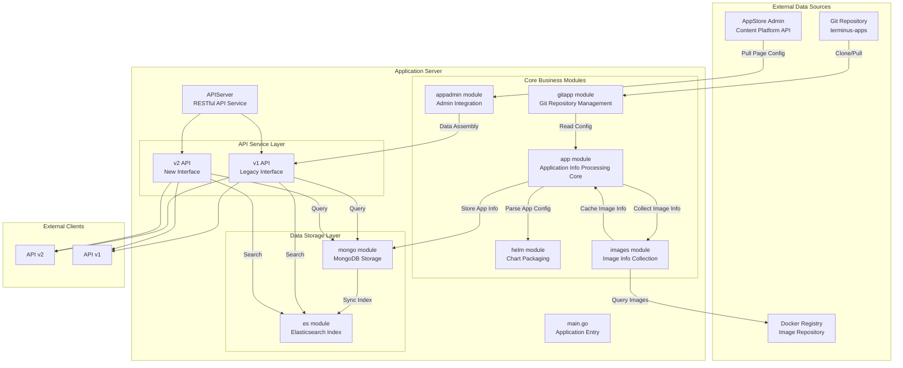
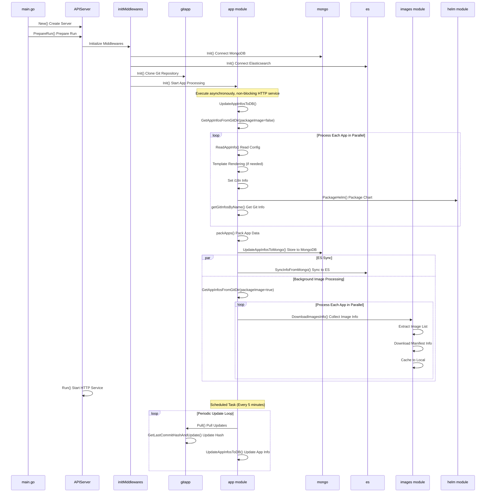
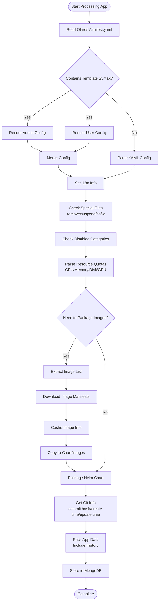
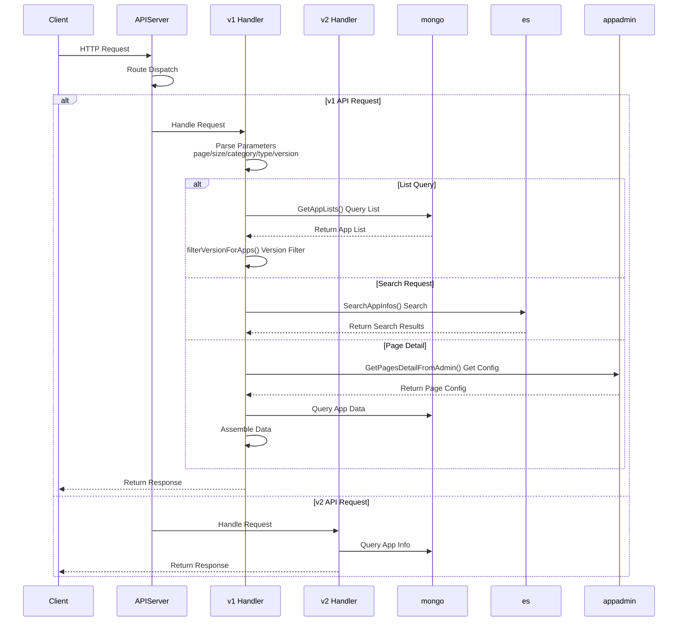
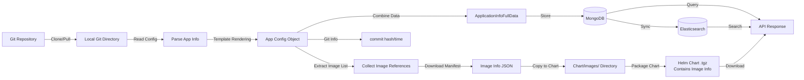

# app-store-server
market-server (app-store-server) is the core backend service for the App Store. It pulls and indexes application information from Git repositories and admin, providing REST APIs for application listing, search, details, etc. to Market frontend and other services.

## Architecture & Design

### Key Points
- **Integration with admin content platform (v1 version, compatible with 1.11.x)**: Through methods like `internal/appadmin.GetPagesDetailFromAdmin(version)`, it pulls page/recommendation/topic configurations from appstore-admin and combines them with application data, hiding admin implementation details from upper layers.
- **v1 + v2 API coexistence**: Both old and new interfaces are mounted simultaneously through `servicev1` and `servicev2` for gradual migration.
- **Version consistency based on lastCommitHash**: Mongo/ES queries default to include `history.latest.lastCommitHash == current hash` condition, ensuring that list and search results are consistent with the current git commit and won't mix in old data.
- **Asynchronous initialization + periodic sync**: Asynchronously executes `UpdateAppInfosToDB` at startup to ensure HTTP service is available quickly; then executes `GitPullAndUpdate` every 5 minutes through `pullAndUpdateLoop` to continuously pull and apply incremental updates.
- **Docker image information collection and caching**: When packaging Charts, scans all image references, uses traditional Registry API (v1) and `containers/image/v5` (v2) to get manifest/inspect information for each image, with retry mechanism, persists to local cache, then synchronously copies to `images/` and `images-v2/` directories under Chart, for multi-architecture image display and offline analysis.

### System Architecture Diagram



### Application Initialization and Update Flow



### Detailed Application Processing Flow



### API Request Processing Flow



## Data Flow



## API Documentation

### Base Information

- **Base URL**: `/app-store-server`
- **API Docs**: `/app-store-server/v1/apidocs.json` (Swagger/OpenAPI format)
- **Response Format**: All APIs return a unified JSON format:
  ```json
  {
    "code": 200,
    "message": "success",
    "data": {}
  }
  ```

### v1 API

#### 1. Get Application List

**GET** `/app-store-server/v1/applications`

Get application list with pagination, category, and type filtering.

**Query Parameters**:
- `page` (string, optional): Page number, starting from 1
- `size` (string, optional): Items per page
- `category` (string, optional): Category filter
- `type` (string, optional): Application type filter
- `version` (string, optional): System version, default "1.10.9-0", supports "latest"

**Response Example**:
```json
{
  "code": 200,
  "message": "success",
  "data": {
    "items": [...],
    "total": 100
  }
}
```

#### 2. Get Application Types

**GET** `/app-store-server/v1/applications/types`

Get list of all application types (categories).

**Query Parameters**:
- `version` (string, optional): System version

**Response Example**:
```json
{
  "code": 200,
  "message": "success",
  "data": {
    "items": ["category1", "category2", ...],
    "total": 10
  }
}
```

#### 3. Download Application Chart

**GET** `/app-store-server/v1/application/{name}`

Download Helm Chart package (.tgz file) for specified application.

**Path Parameters**:
- `name` (string, required): Application name

**Query Parameters**:
- `version` (string, optional): System version

**Response**: Returns binary file stream (.tgz format)

#### 4. Get Top Applications

**GET** `/app-store-server/v1/applications/top`

Get top applications list, sorted by installation count.

**Query Parameters**:
- `size` (string, optional): Number of results
- `type` (string, optional): Application type filter
- `excludedLabels` (string, optional): Excluded labels, comma-separated
- `version` (string, optional): System version

**Response Example**:
```json
{
  "code": 200,
  "message": "success",
  "data": {
    "items": [...]
  }
}
```

#### 5. Get Application Details

**GET** `/app-store-server/v1/applications/info/{name}`

Get detailed information for specified application.

**Path Parameters**:
- `name` (string, required): Application name

**Query Parameters**:
- `version` (string, optional): System version

**Response Example**:
```json
{
  "code": 200,
  "message": "success",
  "data": {
    "id": "app-id",
    "name": "app-name",
    "version": "1.0.0",
    ...
  }
}
```

#### 6. Get Application README

**GET** `/app-store-server/v1/applications/{name}/README.md`

Get README document content for specified application.

**Path Parameters**:
- `name` (string, required): Application name

**Response**: Returns Markdown format text content

#### 7. Update Applications

**POST** `/app-store-server/v1/applications/update`

Manually trigger update of application information from Git repository.

**Response Example**:
```json
{
  "code": 200,
  "message": "success",
  "data": null
}
```

#### 8. Search Applications

**GET** `/app-store-server/v1/applications/search/{name}`

Search applications by name (supports wildcards).

**Path Parameters**:
- `name` (string, required): Search keyword

**Query Parameters**:
- `page` (string, optional): Page number
- `size` (string, optional): Items per page
- `version` (string, optional): System version

**Response Example**:
```json
{
  "code": 200,
  "message": "success",
  "data": {
    "items": [...],
    "total": 10
  }
}
```

#### 9. Get Application Version History

**GET** `/app-store-server/v1/applications/version-history/{name}`

Get all version history records for specified application.

**Path Parameters**:
- `name` (string, required): Application name

**Response Example**:
```json
{
  "code": 200,
  "message": "success",
  "data": {
    "history": {
      "1.0.0": {...},
      "1.1.0": {...},
      "latest": {...}
    }
  }
}
```

#### 10. Check Application Existence

**GET** `/app-store-server/v1/applications/exist/{name}`

Check if specified application exists.

**Path Parameters**:
- `name` (string, required): Application name

**Response Example**:
```json
{
  "code": 200,
  "message": "success",
  "data": {
    "exist": true
  }
}
```

#### 11. Increment Install Counter

**POST** `/app-store-server/v1/counter/{name}`

Increment installation counter for specified application.

**Path Parameters**:
- `name` (string, required): Application name

**Response Example**:
```json
{
  "code": 200,
  "message": "success",
  "data": null
}
```

#### 12. Batch Get Application Info

**POST** `/app-store-server/v1/applications/infos`

Batch get information for multiple applications, used for checking app updates.

**Request Body**:
```json
["app-name-1", "app-name-2", ...]
```

**Response Example**:
```json
{
  "code": 200,
  "message": "success",
  "data": [
    {
      "name": "app-name-1",
      "version": "1.0.0",
      ...
    },
    ...
  ]
}
```

#### 13. Batch Get Application Info (with Version)

**POST** `/app-store-server/v1/applications/infos/{version}`

Batch get information for multiple applications, filtered by specified system version.

**Path Parameters**:
- `version` (string, required): System version

**Request Body**:
```json
["app-name-1", "app-name-2", ...]
```

**Response**: Same as batch get application info

#### 14. Get Page Details

**GET** `/app-store-server/v1/pages/detail`

Get page details including recommendations, topics, etc. (pulled from admin content platform).

**Query Parameters**:
- `version` (string, optional): System version

**Response Example**:
```json
{
  "code": 200,
  "message": "success",
  "data": {
    "pages": {...},
    "recommends": [...],
    "topics": [...]
  }
}
```

### v2 API

#### 1. Get App Store Information

**GET** `/app-store-server/v2/appstore/info`

Get complete app store information including application list, top applications, and statistics.

**Query Parameters**:
- `version` (string, optional): System version, default "1.10.9-0", supports "latest"
- `page` (string, optional): Page number
- `size` (string, optional): Items per page

**Response Example**:
```json
{
  "code": 200,
  "message": "success",
  "data": {
    "appstore": {
      "apps": [...],
      "tops": [
        {
          "appId": "app-name",
          "rank": 1
        },
        ...
      ],
      "stats": {
        "totalApps": 100,
        "totalItems": 50,
        "hash": "abc123..."
      }
    }
  }
}
```

#### 2. Download Application Chart

**GET** `/app-store-server/v2/applications/{name}/chart`

Download Helm Chart package for specified application.

**Path Parameters**:
- `name` (string, required): Application name

**Query Parameters**:
- `version` (string, optional): System version
- `fileName` (string, required): Chart file name (.tgz)

**Response**: Returns binary file stream (.tgz format)

#### 3. Get App Store Hash

**GET** `/app-store-server/v2/appstore/hash`

Get hash value of app store information for checking if data has been updated.

**Query Parameters**:
- `version` (string, optional): System version
- `page` (string, optional): Page number
- `size` (string, optional): Items per page

**Response Example**:
```json
{
  "code": 200,
  "message": "success",
  "data": {
    "hash": "abc123...",
    "updatedAt": "2024-01-01T00:00:00Z"
  }
}
```

### Error Response

All APIs return a unified error format when errors occur:

```json
{
  "code": 400,
  "message": "error message",
  "data": null
}
```

**Common Error Codes**:
- `200`: Success
- `400`: Bad request (invalid parameters)
- `404`: Resource not found
- `500`: Internal server error

### Version Notes

- **version parameter**: 
  - Default value: `"1.10.9-0"`
  - Special value: `"latest"` - Uses value from environment variable `LATEST_VERSION`
  - Other values: Filters applications compatible with specified system version

- **Version Filtering**: All application list queries filter application versions compatible with the specified system version based on the `version` parameter.
