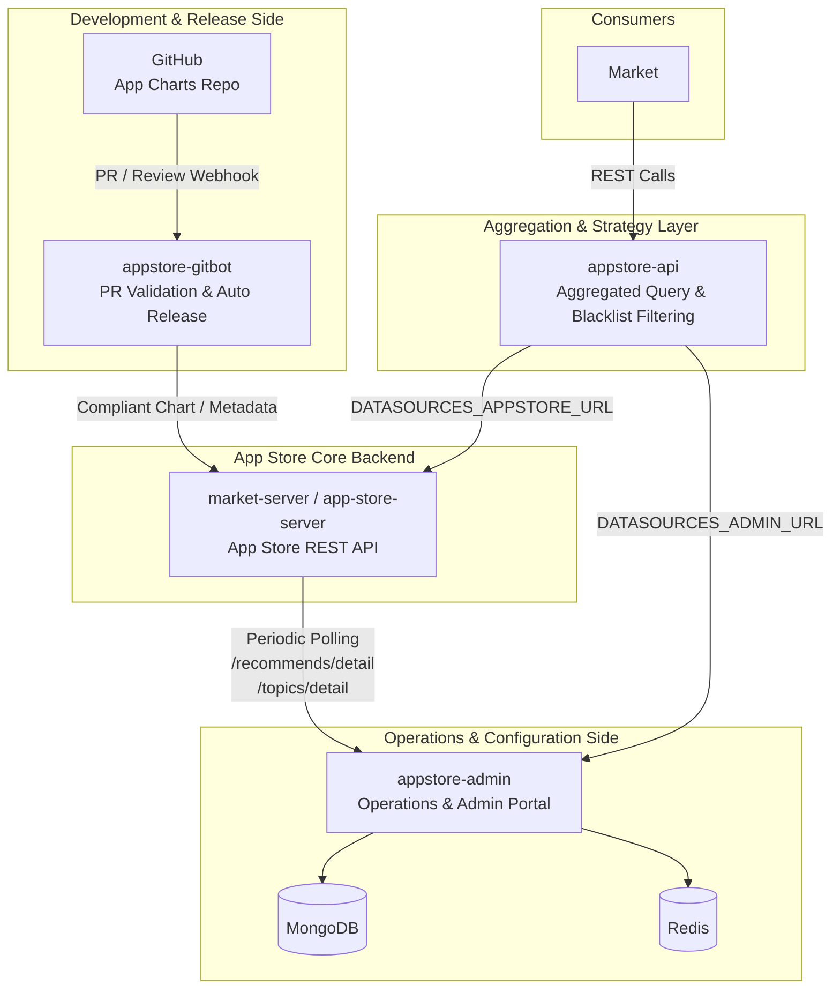

# Appstore System Architecture Diagram

```mermaid
flowchart TB
    %% Development & Release Pipeline
    subgraph DevSide["Development & Release Side"]
        GH[GitHub<br/>App Charts Repo]
        Bot[appstore-gitbot<br/>PR Validation & Auto Release]
    end

    GH -->|PR / Review Webhook| Bot
    Bot -->|Compliant Chart / Metadata| MS

    %% Operations Side
    subgraph OpsSide["Operations & Configuration Side"]
        Admin[appstore-admin<br/>Operations & Admin Portal]
        DB[(MongoDB)]
        Cache[(Redis)]
    end

    Admin --> DB
    Admin --> Cache

    %% Core Backend
    subgraph Core["App Store Core Backend"]
        MS[market-server / app-store-server<br/>App Store REST API]
    end

    MS -->|Periodic Polling<br/>/recommends/detail<br/>/topics/detail| Admin

    %% Aggregation API Layer
    subgraph Agg["Aggregation & Strategy Layer"]
        API[appstore-api<br/>Aggregated Query & Blacklist Filtering]
    end

    API -->|DATASOURCES_ADMIN_URL| Admin
    API -->|DATASOURCES_APPSTORE_URL| MS

    %% Consumers
    subgraph Front["Consumers"]
        MarketFE[Market]
    end

    MarketFE -->|REST Calls| API
```
