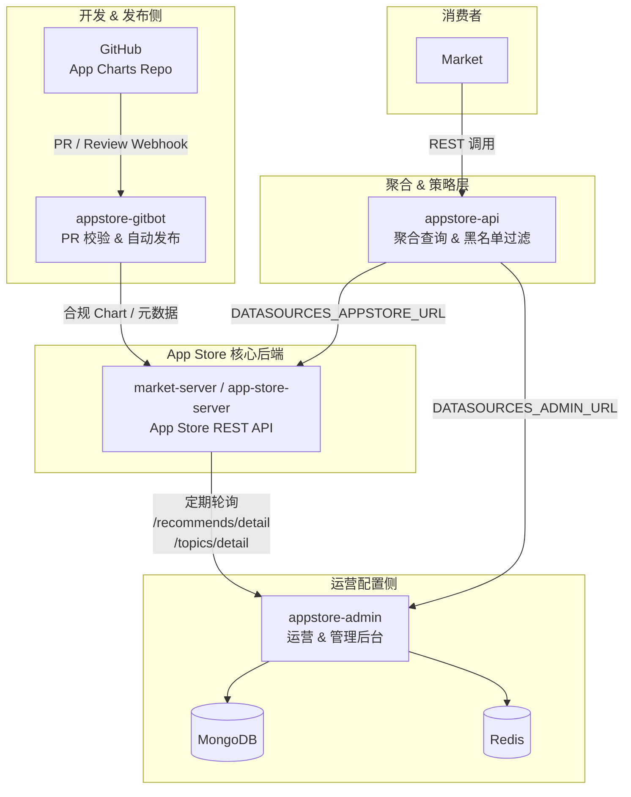

# Appstore 系统整体架构图

```mermaid
flowchart TB
    %% 开发与发布链路
    subgraph DevSide["开发 & 发布侧"]
        GH[GitHub<br/>App Charts Repo]
        Bot[appstore-gitbot<br/>PR 校验 & 自动发布]
    end

    GH -->|PR / Review Webhook| Bot
    Bot -->|合规 Chart / 元数据| MS

    %% 运营侧
    subgraph OpsSide["运营配置侧"]
        Admin[appstore-admin<br/>运营 & 管理后台]
        DB[(MongoDB)]
        Cache[(Redis)]
    end

    Admin --> DB
    Admin --> Cache

    %% 核心后端
    subgraph Core["App Store 核心后端"]
        MS[market-server / app-store-server<br/>App Store REST API]
    end

    MS -->|定期轮询<br/>/recommends/detail<br/>/topics/detail| Admin

    %% 聚合 API 层
    subgraph Agg["聚合 & 策略层"]
        API[appstore-api<br/>聚合查询 & 黑名单过滤]
    end

    API -->|DATASOURCES_ADMIN_URL| Admin
    API -->|DATASOURCES_APPSTORE_URL| MS

    %% 消费者
    subgraph Front["消费者"]
        MarketFE[Market]
    end

    MarketFE -->|REST 调用| API
```